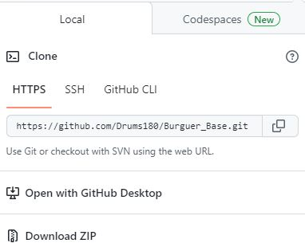
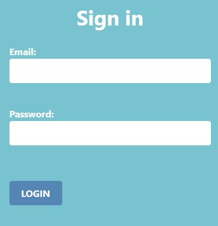
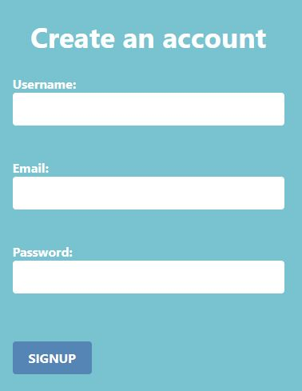

# Burger Base

Burger Base is a web-based application designed for restaurants to manage their inventory. The app connects an inventory database and allows for efficient inventory monitoring and management.

## Features

* Real-time inventory monitoring for critical ingredients such as fries, bread, meat, cheese, onion, and tomatoes etc.  
* User-friendly interface for inventory management.
* Database visualization in the form of graphics
* Compatibility with Node, MySQL, HTML, CSS, and JavaScript technologies

## Technologies

Burger Base is built using the following technologies:

* CSS
* JavaScript
* Node.js
* MySQL
* Heroku
* Express
* Handlebars
* Sequelize

## How to use it

To use Burger Base, please follow the instructions below:

* Install Node.js and MySQL on your computer if you haven't already.
* Clone this repository to your local machine.

* Navigate to the project directory and run the command npm install to install the necessary dependencies.
* Start the app by running the command npm start.
* Open a web browser and navigate to <http://localhost:3000> to access the Burger Base app.
* Log in with your username and password.

*If you don´t have an account you can create an account

## Future plans

We have several plans for future updates to the Burger Base app. Some of the features we plan to implement include:

* Integration with third-party ordering platforms.
* Ability to customize minimum requirements for each ingredient.
* Notification system to alert managers and/or waiters when inventory is running low.
* Implementation of a barcode scanning system for efficient inventory tracking.
* Integration with other restaurant management systems such as point-of-sale and employee scheduling software.
* We are committed to continually improving the Burger Base app to provide the best possible inventory management solution for Burger restaurants.

## Contributing

If you would like to contribute to Burger Base, please follow these guidelines:

Fork the repository.

* Create a new branch for your changes.
* Make your changes and commit them with clear commit messages.
* Push your changes to your forked repository.
* Submit a pull request to the main repository.

## Contact

If you have any questions or issues, please contact the developer at contact@burguerbase.com
